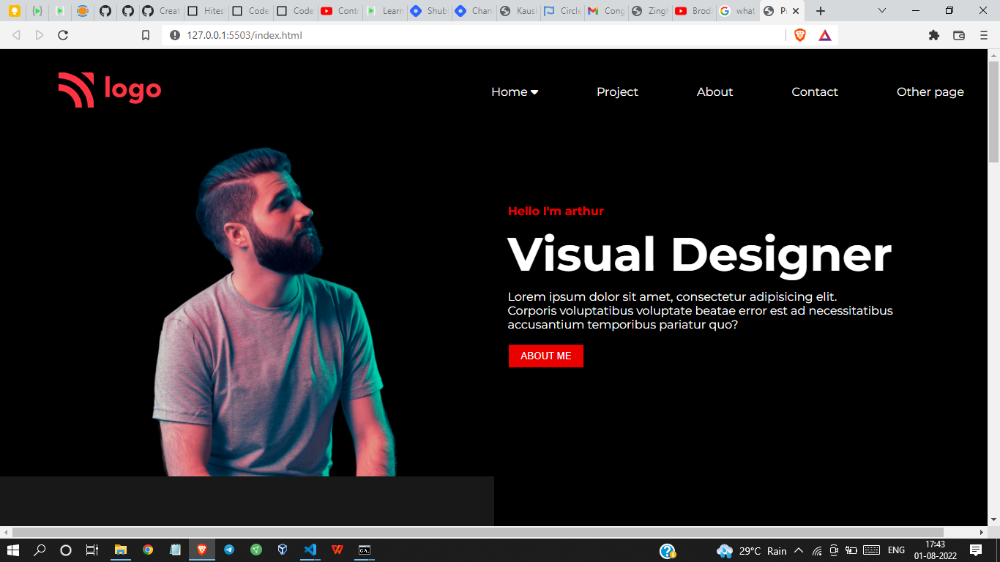

# Project 15 - HTML  and CSS 

By Shreesha

Here's the Live Deployed Website of 

## Project 15  [DEPLOYED LINK](https://project15-product-design-landing-page.netlify.app/)

# What did I learn in this project

- I got to learn about the positioning of containers. 
- Got to learn about the flexbox.
- Got to learn more about beautifying of buttons.

## Time taken to complete project is 5 hours
